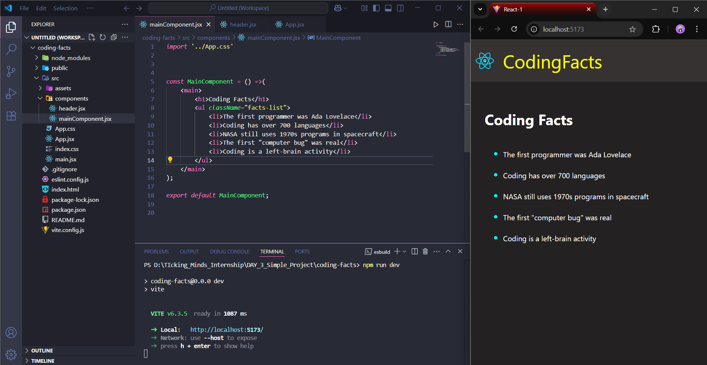

# Recat Static Page on Coding Facts

This Project has been to know about the components in react and create them and renderd the same to other components by reusing them, learnt how to create custom components and also styled these components individually.

# #React  #React Components

